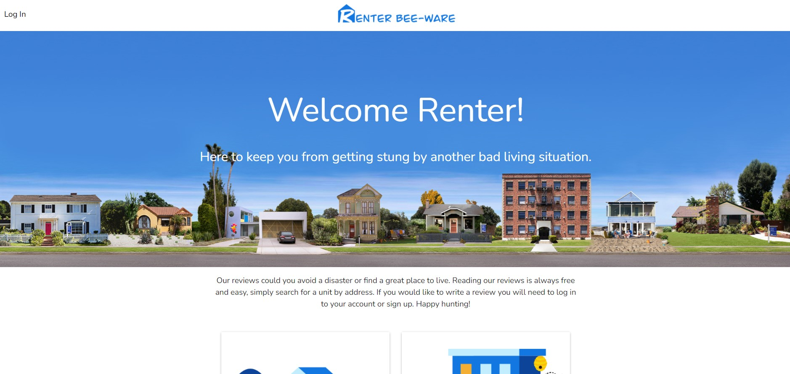

# Welcome to Renter Bee-Ware

We aim to provide a helpful tool in your next search for an apartment or home rental.

  
  
  
  
  
  
  
  
  

## Deployment

<a href="https://renterbeeware.herokuapp.com/" target="_blank">Click here</a> to view the app deployed to Heroku.

## User Story
The group's task was to create a responsive web application using React that can handle basic CRUD operations when interacting with a database. 

## Project Development
This project was developed over one month as a final for the 2020-2021 Full Stack Web Development Bootcamp through UCSD/Trilogy Education. Contributors to the project are as follows: <a href="https://github.com/ducktrshessami" target="_blank">Josh Wee</a>, <a href="https://github.com/ethomas22" target="_blank">Emily Thomas</a>, <a href="https://github.com/dillonhoban" target="_blank">Dillon Hoban</a>, and <a href="https://github.com/ndpenaloza" target="_blank">Nick D. Penaloza</a>

## Validation 
This site’s HTML was validated using a third party service found [here.](https://validator.w3.org/)

## License
[MIT](https://choosealicense.com/licenses/mit/)